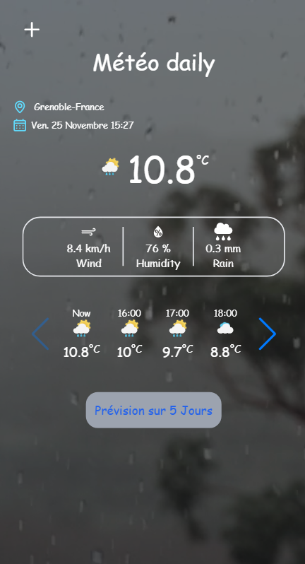

# About the Project:
Météo : a Weather application, today and a week forcasting app, uses a free weather api open-meteo.com.

 [Live Demo](https://weather-iapv.vercel.app/)
 
 

 ## Features:
1. Get the weather of based on the browser geolocation.
2. Weather forecasting for the next five days

## Usage:
    npm install
    npm run start

 ## Technologies Used:
3. ReactJs
4. Tailwind
5. react-router
6. browser géolocalisation Api
7. Context hook
8. swiper-react
